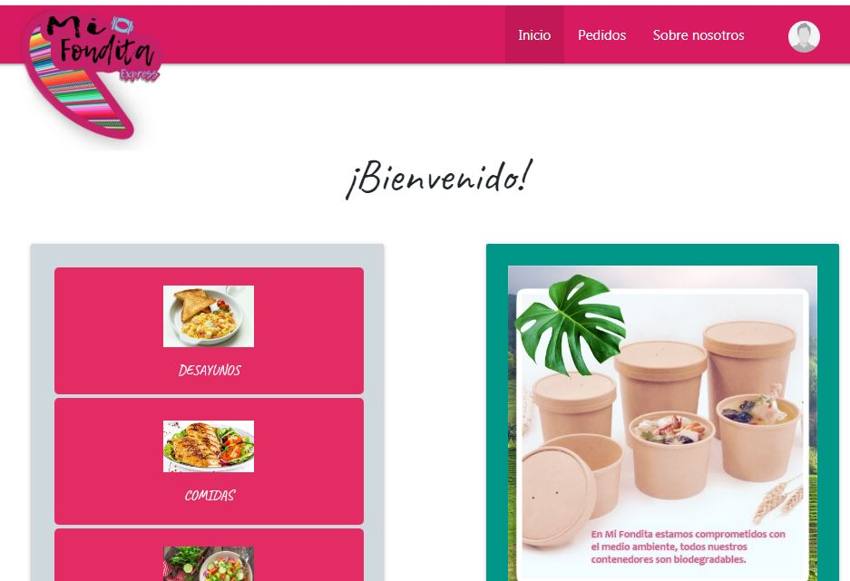
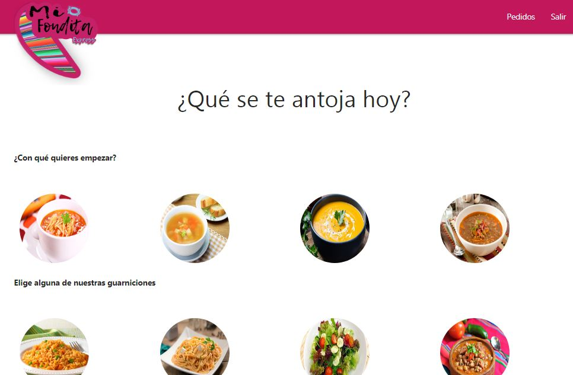
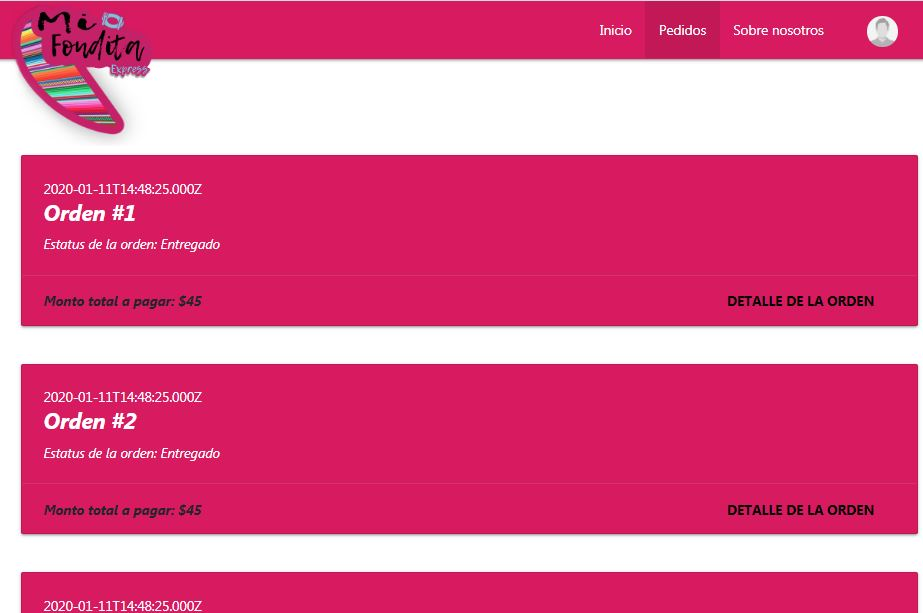

# Mi Fondita Express v1

## Overview

* This project is a copy of the original group project where you can check the commit history and the different versions
* Full Stack application developed with Handlebars.js, Bootstrap, CSS and Materialize in the front end and Node.js, Express.js and MySQL database
* It's a prototype where the app will display different menu options where the customer can select different meals and send the order to be prepared
* The app will display the status and the recent order's history for the customer

## Technologies used to develop the app

- HTML5
- CSS3
- Bootstrap
- Materialize
- HandleBars.js
- Javascript
- JQuery
- JSON
- Axios
- Express.js
- Node.js
- MySQL DB

## Group Project
https://github.com/alfa9317/Project2

## App Link
https://warm-ridge-99326.herokuapp.com/

## Authors
Lesly Sanchez
Francisco Silva
Alejandro Vilchis
Jose Alfredo Torres